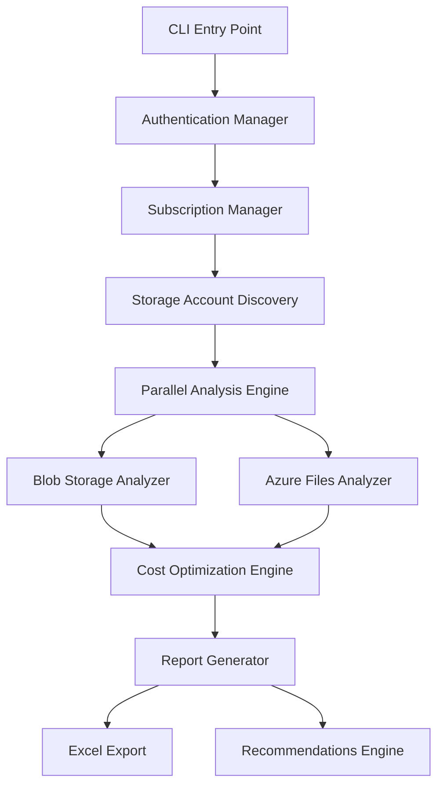

# Azure Storage Analysis Tool v3.0# Azure Storage Analysis


[](https://azure.microsoft.com/)## Overview

[](https://python.org/)This project provides a comprehensive analysis of Azure Storage usage and costs. It processes Azure storage data, generates enhanced reports, and offers actionable recommendations to optimize storage usage and reduce costs.

[](LICENSE)

## Analysis Scope

## 🚀 Overview- **Data Sources:**

  - Raw Azure storage usage and billing CSV exports

Azure Storage Analysis Tool is an enterprise-grade solution for comprehensive Azure Storage cost optimization and analysis. This tool provides deep insights into your Azure Blob Storage and Azure Files usage patterns, identifies cost optimization opportunities, and generates detailed reports across single or multiple Azure subscriptions.   - Enhanced Excel reports generated by the analysis tool

- **Metrics Analyzed:**

### ✨ Key Features  - Storage account usage (by type, region, and SKU)

  - Cost breakdowns (monthly, by resource, by storage class)

- **🌐 Multi-Subscription Support**: Analyze storage across multiple Azure subscriptions with intelligent selection  - Growth trends and historical usage

- **📊 Comprehensive Analysis**: Deep dive into Blob Storage containers, blobs, Azure Files shares, and files  - Unused or underutilized storage resources

- **💰 Cost Optimization**: AI-powered recommendations for reducing storage costs  - Recommendations for cost savings and optimization

- **📈 Professional Reports**: Excel reports with multiple sheets, charts, and actionable insights

- **⚡ High Performance**: Concurrent processing with configurable worker threads## Recommendations Provided

- **🎯 Flexible Filtering**: Advanced filtering by account names, patterns, containers, and file shares- Identify unused or infrequently accessed storage accounts and blobs

- **🔐 Secure Authentication**: Uses Azure CLI authentication or managed identity- Suggest moving data to lower-cost storage tiers (e.g., Cool, Archive)

- Highlight opportunities for lifecycle management and automation

## 📋 Table of Contents- Recommend deletion or consolidation of redundant resources

- Provide insights on data redundancy and geo-replication settings

- [Installation](#-installation)

- [Quick Start](#-quick-start)## Project Structure

- [Usage Guide](#-usage-guide)- `azure_storage_analysis/`: Core package with modular analysis logic (all main logic is here)

- [Command Reference](#-command-reference)   - `core.py`, `auth.py`, `reporting.py`, `recommendations.py`, `utils.py`

- [Cost Optimization Strategies](#-cost-optimization-strategies)- `cli.py`: Main entry point to run the analysis (imports from the package above)

- [Backend Architecture](#-backend-architecture)- `azure_storage_analysis_*.csv`: Raw Azure storage data exports

- [Configuration](#-configuration)- `azure_storage_analysis_enhanced_*.xlsx`: Enhanced analysis reports

- [Output & Reports](#-output--reports)- `requirements.txt`: Python dependencies

- [Troubleshooting](#-troubleshooting)

- [Contributing](#-contributing)## How to Run the Analysis


## 🔧 Installation

### Prerequisites

### Prerequisites- Python 3.8 or higher

- Required Python packages (see below)

- **Python 3.8+** (recommended: Python 3.11+)- Azure CLI (for authentication and subscription management)

- **Azure CLI** installed and configured- Azure storage usage CSV export (download from Azure Portal)

- **Active Azure subscription(s)** with storage accounts

- **Required Azure permissions**: Storage Blob Data Reader, Storage File Data Reader (minimum)#### Azure CLI Setup

1. Download and install the Azure CLI from the official site:

### Step 1: Clone the Repository   https://docs.microsoft.com/en-us/cli/azure/install-azure-cli

2. After installation, open a new terminal and run:

```bash   ```powershell

git clone https://github.com/PrashantAHD/Azure-Storage-Analysis.git   az login

cd Azure-Storage-Analysis   ```

```   This will open a browser window for you to authenticate with your Azure account.

3. (Optional) Set your default subscription:

### Step 2: Set Up Python Environment   ```powershell

   az account set --subscription "<your-subscription-name-or-id>"

#### Option A: Using Virtual Environment (Recommended)   ```

```bash4. Verify your login and subscription:

# Create virtual environment   ```powershell

python -m venv azure-storage-env   az account show

   ```

# Activate virtual environment

# Windows### Installation

azure-storage-env\Scripts\activate1. Clone this repository:

# Linux/Mac   ```powershell

source azure-storage-env/bin/activate   git clone git@github.com:PrashantAHD/Azure-Storage-Analysis.git

```   cd Azure-Storage-Analysis

   ```

#### Option B: Using Conda2. (Optional) Create and activate a virtual environment:

```bash   ```powershell

conda create -n azure-storage python=3.11   python -m venv venv

conda activate azure-storage   .\venv\Scripts\activate

```   ```

3. Install required packages:

### Step 3: Install Dependencies   ```powershell

   pip install -r requirements.txt

```bash   ```

pip install -r requirements.txt   If `requirements.txt` is not present, install common dependencies:

```   ```powershell

   pip install pandas openpyxl

### Step 4: Azure CLI Setup   ```


```bash### Usage

# Login to Azure1. Place your Azure storage CSV export in the project directory.

az login

2. Run the analysis using the CLI entry point:

# Set default subscription (optional)   ```powershell

az account set --subscription "your-subscription-id"   python cli.py --auto

   ```

# Verify authentication   You can use additional command-line options for advanced usage. For help:

az account show   ```powershell

```   python cli.py --help

   ```

### Step 5: Register Azure Storage Provider (if needed)3. The tool will generate an enhanced Excel report with recommendations.


```bash### Output

# Register Microsoft.Storage provider- Enhanced Excel report: `azure_storage_analysis_enhanced_<date>.xlsx`

az provider register --namespace Microsoft.Storage- Summary and recommendations are included in the report


# Check registration status## Customization

az provider show --namespace Microsoft.Storage --query "registrationState"- Modify or extend modules in `azure_storage_analysis/` to adjust analysis logic, reporting, or add new features.

```- Update the CLI (`cli.py`) to support additional options or workflows.


## 🚀 Quick Start## Support

For questions or suggestions, please open an issue on the GitHub repository.

### Basic Usage

## Azure Storage Cost Optimization Resources

```bash

# Simple analysis of current subscription### Key Strategies & Best Practices

python cli.py --auto- **Storage Tiering & Lifecycle Management:**

  - Move infrequently accessed data to Cool, Cold, or Archive tiers.

# Analyze all accessible subscriptions  - Use lifecycle policies to automate tier transitions and deletions.

python cli.py --all-subscriptions --auto  - Be aware of early deletion fees for each tier.

- **Reserved Capacity & Discounts:**

# Interactive subscription selection  - Commit to 1- or 3-year reserved capacity for predictable workloads to save up to 38% (storage) or 72% (compute).

python cli.py --auto  - Use Azure Cost Management to simulate and plan reservations.

# (Will prompt for subscription selection if multiple available)- **Monitor, Audit, and Clean Up:**

```  - Use Azure Advisor and Cost Management for recommendations and alerts.

  - Delete unused resources (disks, snapshots, storage accounts).

### Common Scenarios  - Right-size provisioned resources regularly.

- **Optimize Data Transfer and Redundancy:**

```bash  - Minimize data egress by co-locating compute and storage.

# Production environment analysis  - Choose redundancy (LRS, ZRS, GRS, RA-GRS) based on cost and durability needs.

python cli.py --auto --account-pattern "prod-*" --export-detailed-blobs- **Backup and Encryption:**

  - Use incremental backups, set appropriate retention, and move long-term backups to Archive.

# Skip Azure Files analysis (Blob Storage only)  - Use server-side encryption with managed keys for most scenarios.

python cli.py --auto --no-file-shares- **Cost Management Tools:**

  - Use the [Azure Pricing Calculator](https://azure.microsoft.com/en-us/pricing/calculator/) to estimate costs.

# Skip Blob Storage analysis (Azure Files only)  - Consider third-party tools like Ternary, Turbo360, IBM Cloudability for advanced cost visibility.

python cli.py --auto --no-containers- **Case Studies:**

  - Companies like Maersk, ASOS, and H&R Block achieved savings by regular audits, training, and using Azure’s built-in cost management features.

# High-performance analysis with more workers

python cli.py --auto --max-workers 20### Useful Links

```- [Azure Storage Pricing](https://azure.microsoft.com/en-us/pricing/details/storage/)

- [Azure Blob Storage Pricing](https://azure.microsoft.com/en-us/pricing/details/storage/blobs/)

## 📖 Usage Guide- [Azure Managed Disks Pricing](https://azure.microsoft.com/en-us/pricing/details/managed-disks/)

- [Azure Advisor Cost Recommendations](https://learn.microsoft.com/en-us/azure/advisor/advisor-reference-cost-recommendations)

### Multi-Subscription Analysis- [Azure Storage Access Tiers Overview](https://learn.microsoft.com/en-us/azure/storage/blobs/access-tiers-overview)

- [Azure Blob Lifecycle Management](https://learn.microsoft.com/en-us/azure/storage/blobs/lifecycle-management-policy-access-tiers)

The tool automatically detects available subscriptions and provides intelligent selection options:- [Azure Cost Management and Billing](https://learn.microsoft.com/en-us/azure/cost-management-billing/costs/overview-cost-management)

- [Azure Pricing Calculator](https://azure.microsoft.com/en-us/pricing/calculator/)

#### Scenario 1: Single Subscription- [CloudZero: Azure Storage Cost Optimization](https://www.cloudzero.com/blog/azure-storage-cost-optimization/)

```bash- [Intercept: Azure Storage Pricing Guide](https://intercept.cloud/en-gb/blogs/azure-storage-pricing)

$ python cli.py --auto- [TechTarget: Azure Storage Pricing Guide](https://www.techtarget.com/searchstorage/tip/A-guide-to-Microsoft-Azure-storage-pricing)

📍 Single subscription mode: Only one subscription accessible- [N2WS: Azure Storage Cost Factors](https://n2ws.com/blog/microsoft-azure-cloud-services/azure-storage-costs)

# Proceeds directly to analysis- [Ternary: Azure Cost Management Tools](https://ternary.app/blog/azure-cost-management-tools/)

```- [Medium: Azure Cost Optimization Stories](https://medium.com/@NickHystax/get-inspired-cost-optimization-stories-of-ms-azure-customers-ddf7ebf97042)


#### Scenario 2: Multiple Subscriptions### Storage Types and Starting Prices (Sample)

```bash| Storage Type         | Description                                      | Starting Price (per GiB/month) |

$ python cli.py --auto|---------------------|--------------------------------------------------|-------------------------------|

🔍 Found 3 accessible subscriptions:| Azure Blob          | Scalable object storage for unstructured data    | $0.015                        |

   1. Production Subscription (sub-prod-123)| Azure Files         | Managed file shares for cloud or on-prem use     | $0.0228                       |

   2. Development Subscription (sub-dev-456)| Azure Table         | NoSQL storage for structured data                | $0.045                        |

   3. Test Subscription (sub-test-789)| Azure Queues        | Messaging for asynchronous app communication     | $0.045                        |

| Azure Managed Disks | Durable block storage for VMs                    | $0.30                         |

┌─────────────────────────────────────────────────────────────┐

│                 SUBSCRIPTION SELECTION                      │For more details, see the official [Azure Storage Pricing](https://azure.microsoft.com/en-us/pricing/details/storage/) page.

└─────────────────────────────────────────────────────────────┘

---

Please choose your analysis scope:

  → Enter 'all' to analyze ALL subscriptions**Author:** Prashant Kumar

  → Enter '1' to analyze the first subscription only**Repository:** [Azure-Storage-Analysis](https://github.com/PrashantAHD/Azure-Storage-Analysis)

  → Enter '1,3' to analyze specific subscriptions (comma-separated)
  → Enter 'current' to analyze the current subscription only

📝 Your selection: 1,2
✅ Analysis Scope: 2 subscription(s) selected
   • Production Subscription
   • Development Subscription
```

### Filtering Options

#### Storage Account Filtering
```bash
# Analyze specific storage accounts
python cli.py --auto --account-names storageaccount1 storageaccount2

# Pattern-based filtering
python cli.py --auto --account-pattern "prod-*"

# Limit number of accounts
python cli.py --auto --max-accounts 10
```

#### Container Filtering
```bash
# Specific containers only
python cli.py --auto --container-names container1 container2

# Pattern-based container filtering
python cli.py --auto --container-pattern "*backup*"

# Limit containers per account
python cli.py --auto --max-containers-per-account 5
```

#### File Share Filtering
```bash
# Specific file shares
python cli.py --auto --share-names share1 share2

# Pattern-based share filtering
python cli.py --auto --share-pattern "*data*"

# Limit shares per account
python cli.py --auto --max-shares-per-account 3
```

## 📝 Command Reference

### Basic Commands

| Command | Description | Example |
|---------|-------------|---------|
| `--auto` | Run in automatic mode with intelligent prompts | `python cli.py --auto` |
| `--help` | Show detailed help and examples | `python cli.py --help` |

### Subscription Selection

| Command | Description | Example |
|---------|-------------|---------|
| `--all-subscriptions` | Analyze all accessible subscriptions | `python cli.py --all-subscriptions --auto` |
| `--single-subscription` | Force current subscription only | `python cli.py --single-subscription --auto` |
| `--subscription-ids` | Analyze specific subscription IDs | `python cli.py --subscription-ids sub1 sub2 --auto` |

### Analysis Control

| Command | Description | Example |
|---------|-------------|---------|
| `--no-containers` | Skip Blob Storage analysis | `python cli.py --auto --no-containers` |
| `--no-file-shares` | Skip Azure Files analysis | `python cli.py --auto --no-file-shares` |
| `--max-workers` | Set concurrent worker threads | `python cli.py --auto --max-workers 15` |

### Detailed Export Options

| Command | Description | Example |
|---------|-------------|---------|
| `--export-detailed-blobs` | Export detailed blob information | `python cli.py --auto --export-detailed-blobs` |
| `--export-detailed-files` | Export detailed file information | `python cli.py --auto --export-detailed-files` |
| `--max-blobs-per-container` | Limit blob details per container | `python cli.py --auto --export-detailed-blobs --max-blobs-per-container 1000` |
| `--max-files-per-share` | Limit file details per share | `python cli.py --auto --export-detailed-files --max-files-per-share 500` |

### Advanced Filtering

| Command | Description | Example |
|---------|-------------|---------|
| `--account-names` | Specific storage account names | `python cli.py --auto --account-names acc1 acc2` |
| `--account-pattern` | Pattern to match account names | `python cli.py --auto --account-pattern "prod-*"` |
| `--container-names` | Specific container names | `python cli.py --auto --container-names cont1 cont2` |
| `--container-pattern` | Pattern to match container names | `python cli.py --auto --container-pattern "*backup*"` |
| `--share-names` | Specific file share names | `python cli.py --auto --share-names share1 share2` |
| `--share-pattern` | Pattern to match share names | `python cli.py --auto --share-pattern "*data*"` |

### Limits and Performance

| Command | Description | Example |
|---------|-------------|---------|
| `--max-accounts` | Maximum accounts to process | `python cli.py --auto --max-accounts 20` |
| `--max-containers-per-account` | Maximum containers per account | `python cli.py --auto --max-containers-per-account 10` |
| `--max-shares-per-account` | Maximum shares per account | `python cli.py --auto --max-shares-per-account 5` |

## 💰 Cost Optimization Strategies

The tool provides intelligent cost optimization recommendations based on industry best practices and Azure pricing models.

### 🔍 Analysis Categories

#### 1. **Storage Lifecycle Management**
- **Cold Data Detection**: Identifies data not accessed for 30-90+ days
- **Archive Candidates**: Files suitable for Archive tier (>180 days old)
- **Lifecycle Policies**: Automated tier transition recommendations

#### 2. **Storage Tier Optimization**
- **Hot vs Cool Analysis**: Usage pattern analysis for tier recommendations
- **Access Pattern Metrics**: Frequency and timing of data access
- **Cost Impact Projections**: Estimated savings from tier changes

#### 3. **Redundancy Right-sizing**
- **LRS vs GRS Analysis**: Redundancy requirement assessment
- **Regional Considerations**: Multi-region vs single-region strategies
- **Compliance Requirements**: Data residency and backup needs

#### 4. **Capacity Optimization**
- **Empty Container Detection**: Unused containers consuming resources
- **Small File Consolidation**: Optimization for storage transaction costs
- **Duplicate Data Analysis**: Potential deduplication opportunities

### 📊 Cost Calculation Framework

The tool uses Azure's pricing model to calculate potential savings:

```python
# Example cost calculation logic
monthly_savings = {
    'hot_to_cool': gb_size * 0.0184 * 0.5,  # ~50% savings
    'cool_to_archive': gb_size * 0.0099 * 0.8,  # ~80% savings
    'lrs_to_grs_optimization': gb_size * redundancy_delta,
    'lifecycle_automation': transaction_cost_reduction
}
```

### 🎯 Actionable Recommendations

#### High Impact Recommendations
1. **Implement Lifecycle Management Policies**
   ```bash
   # Azure CLI command to create lifecycle policy
   az storage account management-policy create \
     --account-name myaccount \
     --policy @lifecycle-policy.json
   ```

2. **Tier Optimization**
   ```bash
   # Move blob to cool tier
   az storage blob set-tier --tier Cool \
     --account-name myaccount \
     --container-name mycontainer \
     --name myblob
   ```

3. **Redundancy Optimization**
   ```bash
   # Change redundancy from GRS to LRS
   az storage account update \
     --name myaccount \
     --sku Standard_LRS
   ```

#### Medium Impact Recommendations
- Remove empty containers
- Consolidate small files
- Implement retention policies
- Optimize access patterns

#### Low Impact Recommendations
- Monitor usage trends
- Review backup strategies
- Evaluate regional placement
- Assess compression opportunities

## 🏗️ Backend Architecture

### System Design



### Core Components

#### 1. **Authentication Layer** (`auth.py`)
- **Azure CLI Integration**: Primary authentication method
- **Service Principal Support**: For automated environments
- **Managed Identity**: For Azure-hosted scenarios
- **Multi-Subscription Handling**: Cross-subscription authentication

```python
# Key functions
def get_azure_credential()
def get_all_subscriptions(credential)
def get_storage_accounts_from_subscription(credential, subscription_id)
```

#### 2. **Analysis Engine** (`core.py`)
- **Concurrent Processing**: Configurable worker thread pool
- **Resource Discovery**: Automatic storage account enumeration
- **Data Collection**: Comprehensive metadata gathering
- **Error Handling**: Robust exception management

```python
# Core analysis functions
def get_azure_storage_analysis_enhanced()
def get_multi_subscription_analysis()
def analyze_storage_containers()
def analyze_file_shares()
```

#### 3. **Cost Optimization Engine** (`recommendations.py`)
- **Pattern Recognition**: Usage pattern analysis
- **Rule-Based Engine**: Best practice recommendations
- **Cost Calculation**: Savings estimation algorithms
- **Priority Scoring**: Impact-based recommendation ranking

```python
# Recommendation functions
def generate_cost_recommendations()
def analyze_lifecycle_opportunities()
def calculate_tier_optimization_savings()
def assess_redundancy_optimization()
```

#### 4. **Reporting Engine** (`reporting.py`)
- **Multi-Sheet Excel Generation**: Professional report formatting
- **Chart Generation**: Visual data representation
- **Summary Dashboards**: Executive-level insights
- **Detailed Data Export**: Raw data for further analysis

```python
# Reporting functions
def create_enhanced_excel_report()
def generate_summary_dashboard()
def create_detailed_analysis_sheets()
def format_professional_report()
```

#### 5. **Utilities Layer** (`utils.py`)
- **Data Formatting**: Human-readable size conversions
- **Validation Functions**: Input and data validation
- **Helper Functions**: Common utility operations
- **Pattern Matching**: Advanced filtering capabilities

### Performance Optimizations

#### Concurrent Processing
- **Thread Pool Executor**: Configurable worker threads (default: 10)
- **Asynchronous Operations**: Non-blocking I/O operations
- **Batch Processing**: Efficient bulk operations
- **Memory Management**: Optimized for large datasets

#### Caching Strategy
- **Authentication Caching**: Reuse credentials across operations
- **Metadata Caching**: Temporary storage for repeated queries
- **Result Aggregation**: Efficient data consolidation

#### Error Recovery
- **Retry Logic**: Automatic retry with exponential backoff
- **Graceful Degradation**: Partial results on failures
- **Detailed Logging**: Comprehensive error tracking
- **Fallback Mechanisms**: Alternative processing paths

## ⚙️ Configuration

### Environment Variables

```bash
# Optional configuration
export AZURE_STORAGE_ANALYSIS_MAX_WORKERS=15
export AZURE_STORAGE_ANALYSIS_TIMEOUT=300
export AZURE_STORAGE_ANALYSIS_LOG_LEVEL=INFO
```

### Configuration Files

Create `config.json` for advanced settings:

```json
{
  "analysis": {
    "max_workers": 10,
    "timeout_seconds": 300,
    "retry_attempts": 3
  },
  "reporting": {
    "include_charts": true,
    "detailed_export": false,
    "max_items_per_sheet": 10000
  },
  "cost_optimization": {
    "min_age_for_cool": 30,
    "min_age_for_archive": 90,
    "enable_recommendations": true
  }
}
```

### Performance Tuning

#### For Large Environments
```bash
# Increase workers and limits
python cli.py --auto \
  --max-workers 20 \
  --max-containers-per-account 100 \
  --max-shares-per-account 50
```

#### For Quick Analysis
```bash
# Limit scope for faster results
python cli.py --auto \
  --max-accounts 5 \
  --max-containers-per-account 10 \
  --no-file-shares
```

## 📊 Output & Reports

### Excel Report Structure

The tool generates comprehensive Excel reports with multiple worksheets:

#### 1. **Executive Summary**
- High-level metrics and KPIs
- Cost optimization overview
- Subscription and account summaries
- Key recommendations

#### 2. **Blob Storage Analysis**
- Container-level details
- Size distribution analysis
- Access pattern insights
- Lifecycle recommendations

#### 3. **Azure Files Analysis**
- File share utilization
- Capacity planning insights
- Performance metrics
- Growth trends

#### 4. **Cost Optimization**
- Detailed recommendations
- Savings calculations
- Implementation roadmap
- Priority matrix

#### 5. **Raw Data**
- Complete dataset export
- Filterable data tables
- Pivot table ready format
- Custom analysis support

### Report Naming Convention

```
azure_storage_analysis_enhanced_YYYYMMDD_HHMMSS.xlsx
```

Example: `azure_storage_analysis_enhanced_20250920_143022.xlsx`

### Sample Output Metrics

```
Storage Overview:
├── Total Accounts: 15
├── Total Containers: 342
├── Total File Shares: 28
├── Total Storage Size: 2.3 TB
├── Monthly Cost Estimate: $156.78
└── Potential Monthly Savings: $47.23 (30%)

Cost Optimization Opportunities:
├── Lifecycle Management: $32.45/month
├── Tier Optimization: $12.67/month
├── Redundancy Right-sizing: $2.11/month
└── Empty Container Cleanup: $0.00/month
```

## 🔧 Troubleshooting

### Common Issues

#### Authentication Issues
```bash
# Clear Azure CLI cache
az account clear
az login

# Check current context
az account show
az account list
```

#### Permission Issues
```bash
# Check role assignments
az role assignment list --assignee your-user@domain.com

# Required minimum roles
az role assignment create \
  --role "Storage Blob Data Reader" \
  --assignee your-user@domain.com \
  --scope /subscriptions/sub-id/resourceGroups/rg-name
```

#### Performance Issues
```bash
# Reduce worker count for limited resources
python cli.py --auto --max-workers 5

# Limit analysis scope
python cli.py --auto --max-accounts 10
```

#### Memory Issues
```bash
# Limit detailed exports
python cli.py --auto \
  --max-blobs-per-container 1000 \
  --max-files-per-share 500
```

### Debug Mode

Enable detailed logging:

```bash
# Set environment variable
export AZURE_STORAGE_ANALYSIS_LOG_LEVEL=DEBUG

# Run with verbose output
python cli.py --auto --max-workers 1
```

### Error Codes

| Error Code | Description | Solution |
|------------|-------------|----------|
| AUTH_001 | Authentication failed | Run `az login` |
| PERM_002 | Insufficient permissions | Check role assignments |
| NET_003 | Network connectivity | Check internet connection |
| SUB_004 | Subscription not found | Verify subscription ID |
| RES_005 | Resource group not accessible | Check resource permissions |

## 🤝 Contributing

We welcome contributions to improve the Azure Storage Analysis Tool!

### Development Setup

```bash
# Fork and clone the repository
git clone https://github.com/yourusername/Azure-Storage-Analysis.git
cd Azure-Storage-Analysis

# Create development environment
python -m venv dev-env
source dev-env/bin/activate  # Linux/Mac
# or
dev-env\Scripts\activate  # Windows

# Install development dependencies
pip install -r requirements.txt
pip install -r requirements-dev.txt
```

### Running Tests

```bash
# Run unit tests
python -m pytest tests/

# Run integration tests
python -m pytest tests/integration/

# Run with coverage
python -m pytest --cov=azure_storage_analysis tests/
```

### Code Quality

```bash
# Format code
black azure_storage_analysis/

# Lint code
flake8 azure_storage_analysis/

# Type checking
mypy azure_storage_analysis/
```

### Submitting Changes

1. Create a feature branch: `git checkout -b feature/your-feature`
2. Make your changes and add tests
3. Ensure all tests pass: `pytest`
4. Submit a pull request with detailed description

## 📄 License

This project is licensed under the MIT License. See [LICENSE](LICENSE) file for details.

## 🔗 Related Resources

- [Azure Storage Documentation](https://docs.microsoft.com/en-us/azure/storage/)
- [Azure CLI Reference](https://docs.microsoft.com/en-us/cli/azure/)
- [Azure Storage Pricing](https://azure.microsoft.com/en-us/pricing/details/storage/)
- [Azure Cost Management](https://docs.microsoft.com/en-us/azure/cost-management-billing/)

## 📞 Support

- **Issues**: [GitHub Issues](https://github.com/PrashantAHD/Azure-Storage-Analysis/issues)
- **Discussions**: [GitHub Discussions](https://github.com/PrashantAHD/Azure-Storage-Analysis/discussions)
- **Email**: support@azurestorageanalysis.com

---

**Made with ❤️ for Azure Cloud Optimization**